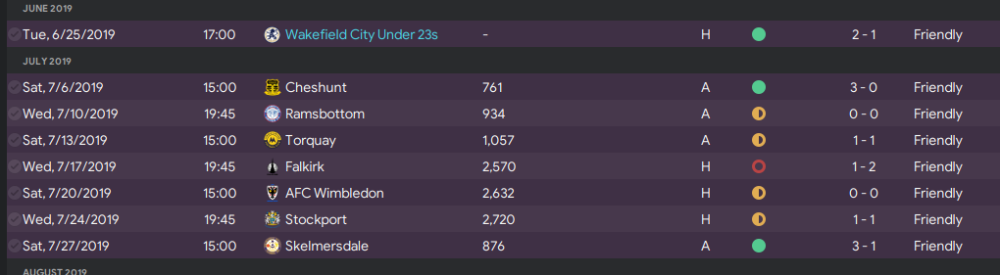
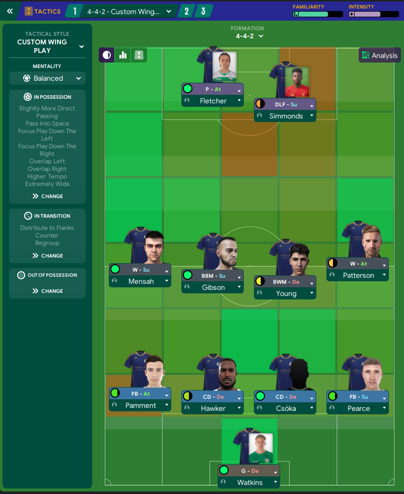
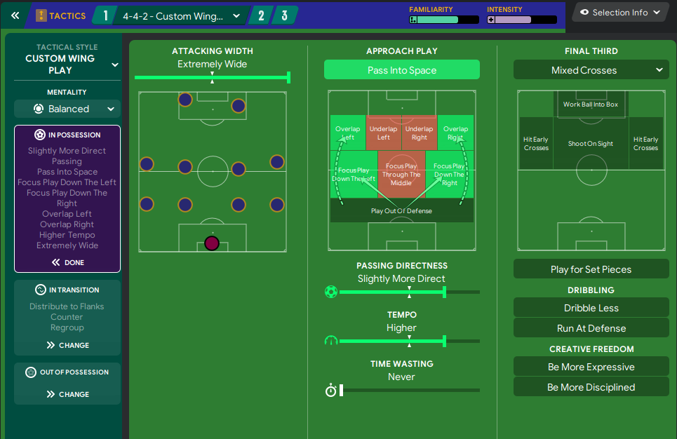
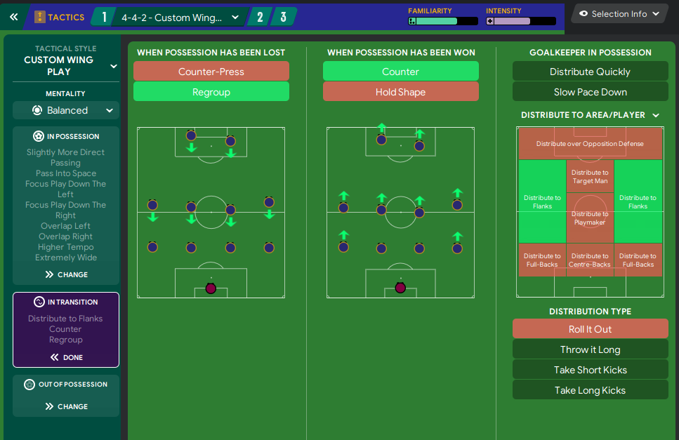
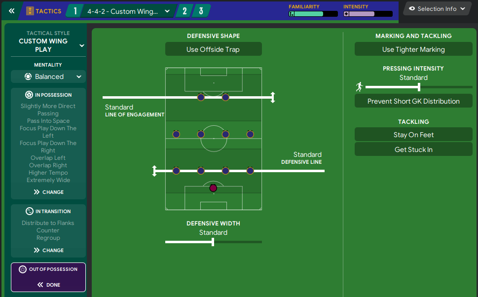
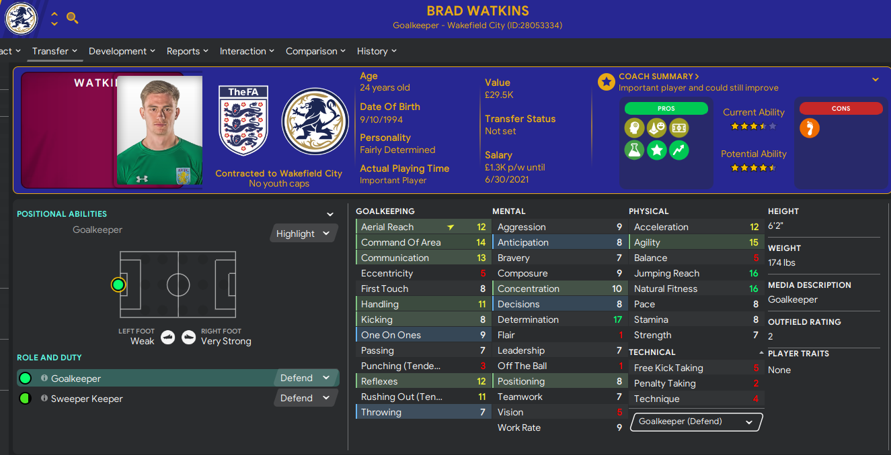
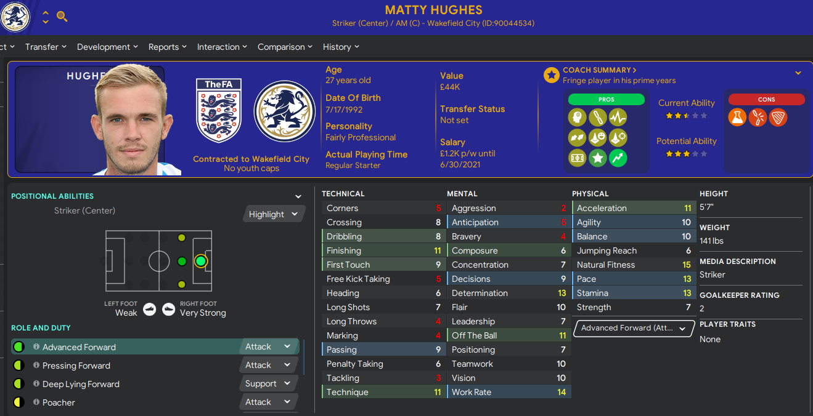
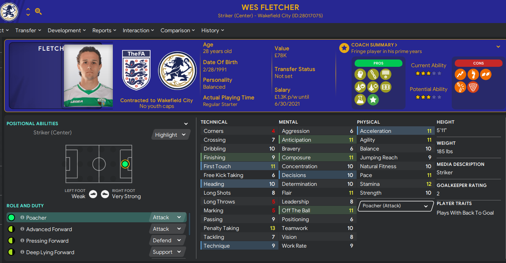
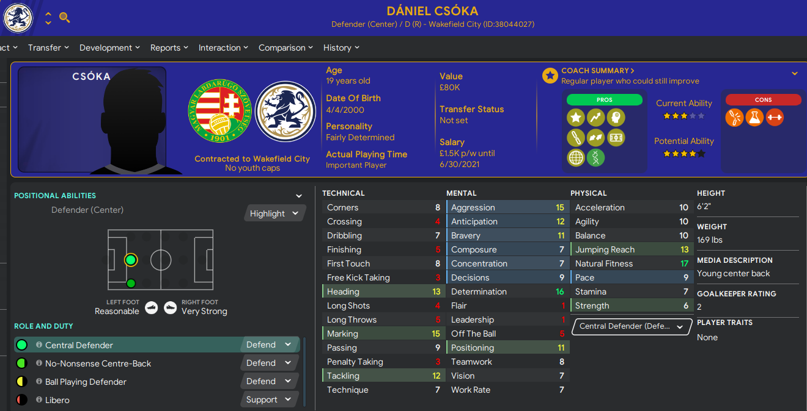
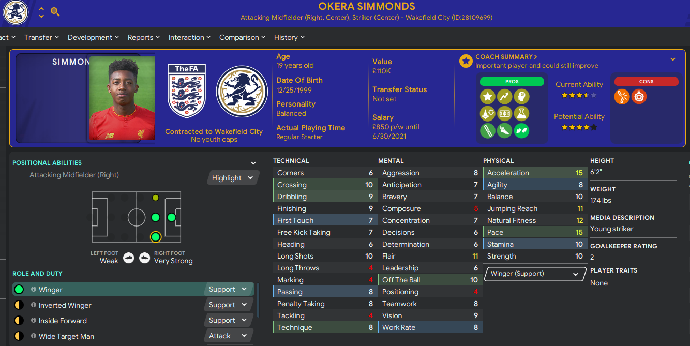

Welcome to Wakefield City. We have finished the pre-season and the results were mixed.

We started with a new 4-4-2 Wing Play tactic. I wanted to do something easy to see what the team did and want to bring out their talents. We will adjust along the way. As most of you know, I don’t do my own tactics very often but I’m going to only do my own in this save.

I ended up going with a more direct passing approach with a higher tempo. We want to use the overlaps to get more movement going and hopefully create more chances. We are also using a very wide attacking formation to help open up more spaces. We want to utilize those spaces and pass into them.

To help with this, we want to use a counter mentality when possession has been won and move players up into those open spaces. We are also distributing to the flanks when the goal keeper has the ball to try to catch the opposition while they switch. When we do lose possession, we want to regroup as quickly as possible to not allow cheap balls over the top.

Lastly, I didn’t want to put too many rules on playing out of possession. Standard lines for defense and engagement so that we can be there if possession is lost. Standard width should be good enough with a four-man defensive line.

In terms of transfers, we have brought in 6 new players so far with 1 goal keeper, 2 center backs and 3 attacking players. I’m looking for a mix of youth and veterans to balance the team with good youth prospects and established vets who can provide leadership.

First I brought in Brad Watkins on a free who is a GK. He has some great skills for this level and I love the determination. He’s pricey but we can afford it.

Matty Hughes is a journeyman forward who I am hoping can bring some depth to the club. He has decent physicals and a good personality.

Wes Fletcher comes in right now as our #1 striker. His numbers aren’t great but he’s solid for this level.

We opened the checkbook for this one, Daniel Csoka. At a price of £88k, he is a young center back with tons of potential. Natural Fitness at 17 and Determination of 16 are super impressive for a 19-year-old. He will be a starter for now.

Okera Simmonds is another young prospect that I think will mature nicely. He’s got a lot of potential and can help us on day one. Came in on a free and already worth some good money.

Lastly, Reece Brown comes in at Right Back and Center Back. He’s been around the English system for a while and hopefully will help be the glue on the team. He has decent attributes and I think will be an asset for a couple of years.

So in all, we’ve only spent £88k of our transfer budget but I don’t want to spend just because it’s there. I want to make the right moves and I am willing to be patient to do that. We have a year to build the team and then can push for playoffs next year, which is what the board wants. 

Next time we’ll recap some games and any player movements.