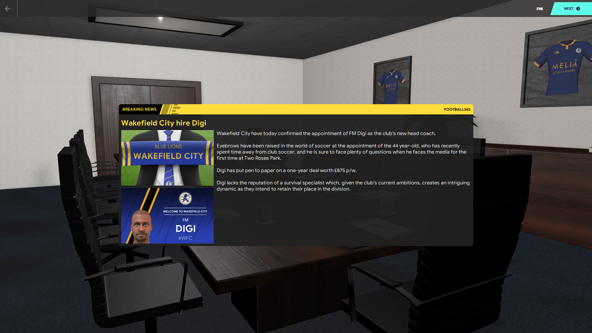
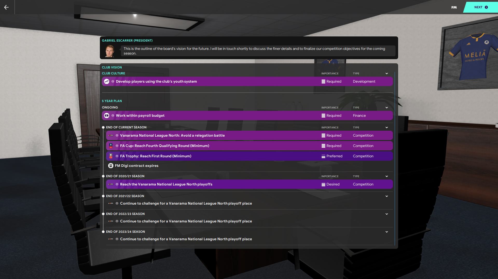

A few months ago I was on Twitter catching up with all the Football Manager comings and goings when I saw a tweet that mentioned a new database up on FM Scout. As a database editor, I’m always interested in seeing what others do but this one caught my eye in terms of a fun save too.

I went to check it out and loved the idea. I downloaded it and started a new save and played for a few hours over that weekend. Really fun save and I thought that it would have been cool to share with others. As you know, I have my Youtube channel where I already have 2 series going and didn’t want to start a third. So I played a bit but became busy with life and the other two series that I have.

It hit me the other day that I could share it here. I can start it new and do it with the new blog. So that’s what this is. Hopefully, you enjoy it.

The history with the club is that there is none. The owners are a hotel chain with £25 million added to the club’s finances. But that means that they mean business and want to see success soon to recoup their investment. Luckily in the initial board meeting, we are given one year to figure things out before we are expected to be a VNN playoff team in season two.

I’m excited to “get stuck in” with the club and make some good signings. We are a Semi-Professional side now but hopefully, the board will fix that as I really need the increased training to advance. I did ask them right away but was turned down.

Stay tuned for future updates as the next entry will have new players and new staff members to meet.